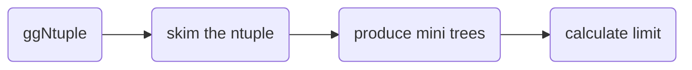

# HDalitz electron channel analysis

 is a rare Higgs decay analogous to the Dalitz decay of nutral pion. This repository is for the electron channel of Higgs Dalitz decay() analysis. The analysis is performed using [RDataFrame](https://root.cern/doc/master/classROOT_1_1RDataFrame.html) which makes analysis efficient to go parallel on multiple threads.


## Workflow

1. **ggNtuple** is produced with the [ggNtuplizer](https://github.com/cmkuo/ggAnalysis/tree/106X) by NCU group.
2. **skimTree.py** is used to preprocess the ggNtuple. It do the minimum selections such as HLT to reduce the ntuple size. It also add ID prediction to the non-flat ntuple via the python package [uproot](https://uproot.readthedocs.io/en/latest/index.html).
3. **rdfxAna.C** is the main analysis script to produce the flat mini trees.
4. Calculate limit using **flashggFinalFit** package.


## Usage
Brfore runing the sripts, you need to specify the path of the ntuple in **./pluginsV2/SampleConfig.py**

### preprocess the ntuple
```bash
$ python3 skimTree.py --run [sample to run] --era [era]
```
- `-r --run`: specify which sample to run (test or Data or HDalitz)
  - test: only process the ggF signal sample @ 125 GeV
  - Data: process the dataset specify in the SampleConfig.DataSample
  - HDalitz: process full signal samples 
- `-r --era`: 2016_preVFP or 2016_postVFP or 2017 or 2018 
- `-n --NCPUs`: use all available cores by default.

### produce mini trees
To execute **rdfxAna.C**, you can use **rdfxAnaRun.py**. It will compile **rdfxAna.C** and do the selections on the skimmed ntuple to produce the flat mini trees.
```bash
$ python3 rdfxAnaRun.py --run [sample to run] --year [year] --doSys [option]
```
- `-r --run`: specify which sample to run (test or Data or HDalitz)
  - test: only process the ggF signal sample @ 125 GeV
  - Data: process the dataset specify in the SampleConfig.DataSample
  - HDalitz: process full signal samples 
- `-y --year`: 2016 or 2017 or 2018 
- `-d --doSys`: produce the mini trees for estimating the experimental uncertainties or not. (True or False)
- `-n --NCPUs`: use all available cores by default.

Once mini trees are produced, you can use **Significance.py** to calculate [Approximate Median Significance](https://arxiv.org/abs/1007.1727)
```bash
$ python3 Significance.py
```


## Content of subfolders
- **Misc**: It contains several studies used in the main analysis, such as generator study and ID training.
  - Energy correction
  - Merged ID efficiency
  - Generator study
  - ID training
- **flashggFinalFit**: Forked from the official [flashgg](https://github.com/cms-analysis/flashggFinalFit) with some modification.
- **pluginsV2**: Several header files used in **skimTree.py** and **rdfxAna.C** are put in this drectory.
- **external**: Files for SFs, pile-up weight and R9 correction are put in this directory 


## To-Do
- [ ] UL signal samples
- [ ] SFs measurements of Merged ID  
  - Scripts are almost done.
  -  (only two-track converted photons with radius < 16cm are used)
- [ ] Trigger SFs (Diphoton/Dielectron)
- [ ] SFs measurements of electron veto and missing hits.
- [ ] Hgg preselection SFs


